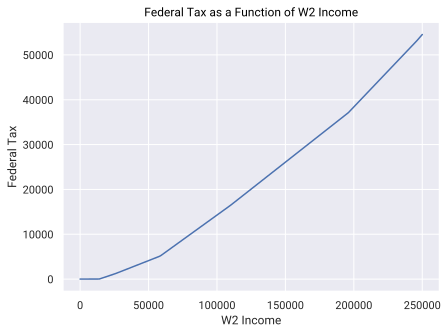
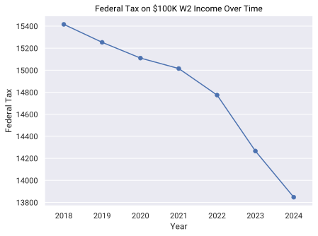
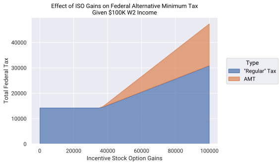

# tenforty

[](https://github.com/mmacpherson/tenforty/actions)
[](https://results.pre-commit.ci/latest/github/mmacpherson/tenforty/main)
[](https://pypi.org/project/tenforty/)
[](https://pypi.org/project/tenforty/)
[](https://pypi.org/project/tenforty/)
[](https://github.com/mmacpherson/tenforty/blob/main/LICENSE.txt)


## Overview

`tenforty` is an open-source Python package designed to help demystify US
federal and state tax computations. This project offers an accessible way to
explore tax scenarios, compare different tax situations, and understand the
impact of various factors on tax liabilities. It's particularly useful for those
who would like to understand or optimize their taxes by evaluating how tax form
inputs affect their outputs.

The package is built on top of the
[Open Tax Solver](https://opentaxsolver.sourceforge.net/)
project, wrapping its
functionality into a Python library.

A GPT interface to `tenforty` is available with a ChatGPT+ account
[here](https://chat.openai.com/g/g-jkF9Et8tT-tax-driver). This GPT, and the
`tenforty` package itself, are discussed in a blog post
[here](https://finedataproducts.com/posts/2024-03-10-tax-scenarios-with-ai/).

You can try `tenforty` out immediately in your browser via the included Colab
notebook: [](https://colab.research.google.com/github/mmacpherson/tenforty/blob/main/notebooks/tenforty_Package_Demo.ipynb)


## Features

- Compute US federal taxes, as well as taxes for several US states.
- Explore how taxes vary as a function of income, state, filing status, and year.
- Easily integrate with data analysis and visualization tools in Python with `pandas` support.
- Evaluate "what if" tax scenarios efficiently and reproducibly.


## Disclaimer

`tenforty` is an open-source tool intended for informational and educational
purposes only and does not provide tax advice.

Known limitations of this package are detailed in the
[Limitations](#known-limitations) section below.

## Installation

```sh
pip install tenforty
```


## Main Functions Documentation

The two functions `evaluate_return` and `evaluate_returns` are the main
interface to `tenforty`. They take exactly the same arguments, except that any
of the arguments to `evaluate_returns` may either be a single value, or a list
of values. `evaluate_return` is for evaluating one single return, and
`evaluate_returns` evaluates all combinations of inputs subtended by the
provided values and collects the results into a dataframe.

The inputs to either function are validated, and if for example a filing status
is misspelled, you'll get an informative error message along with a list of the
valid options.

Here are all arguments available for those two functions:


| Argument                     | Type                     | Default             | Notes                              |
|------------------------------|--------------------------|---------------------|------------------------------------|
| `year`                       | int                      | 2024                | 2018-2024 inclusive                |
| `state`                      | str \| None               | None                | "CA", "NY", "MA" + "AK", "FL", "NV", "SD", "TX", "WA", "WY" |
| `filing_status`              | str                      | Single              | "Single", "Married/Joint", "Head_of_House", "Married/Sep", "Widow(er)" |
| `num_dependents`             | int                      | 0                   |                                    |
| `standard_or_itemized`       | str                      | Standard            | "Standard" or "Itemized"               |
| `w2_income`                  | float                    | 0.0                 |                                    |
| `taxable_interest`           | float                    | 0.0                 |                                    |
| `qualified_dividends`        | float                    | 0.0                 |                                    |
| `ordinary_dividends`         | float                    | 0.0                 |                                    |
| `short_term_capital_gains`   | float                    | 0.0                 |                                    |
| `long_term_capital_gains`    | float                    | 0.0                 |                                    |
| `schedule_1_income`          | float                    | 0.0                 |                                    |
| `itemized_deductions`        | float                    | 0.0                 |                                    |
| `state_adjustment`           | float                    | 0.0                 |                                    |
| `incentive_stock_option_gains` | float                  | 0.0                 |                                    |

The functions output these fields:

| Output Field                    |
|---------------------------------|
| total_tax                       |
| federal_adjusted_gross_income   |
| federal_effective_tax_rate      |
| federal_tax_bracket             |
| federal_taxable_income          |
| federal_amt                     |
| federal_total_tax               |
| state_adjusted_gross_income     |
| state_taxable_income            |
| state_total_tax                 |
| state_tax_bracket               |
| state_effective_tax_rate        |


## Examples

Here are some examples of what you can do with `tenforty`:

### Basic Evaluation

The `evaluate_return` function computes the outputs for a single tax return
given some inputs:

``` python
from tenforty import evaluate_return

evaluate_return(
    w2_income=100_000, state="CA", filing_status="Married/Joint", num_dependents=2
).model_dump()
```

This results in the following:

``` python
{'total_tax': 8484.0,
 'federal_adjusted_gross_income': 100000.0,
 'federal_effective_tax_rate': 11.4,
 'federal_tax_bracket': 12.0,
 'federal_taxable_income': 74100.0,
 'federal_amt': 0.0,
 'federal_total_tax': 8484.0,
 'state_adjusted_gross_income': 0.0,
 'state_taxable_income': 0.0,
 'state_total_tax': 0.0,
 'state_tax_bracket': 0.0,
 'state_effective_tax_rate': 0.0}
```

No `year=` argument was specified here, so the current tax year, 2024, was used.
The output is a pydantic model, and we've called its `.model_dump()` method to
show the result as a dictionary.


### Creating Tax Tables: Federal/State Tax Brackets as a Function of W2 Income

The `evaluate_returns` method sweeps out a grid over any input arguments that
are provided as lists, allowing you to evaluate a wide array of tax scenarios.
Here we make a simple tax table by varying W2 income:

``` python
from tenforty import evaluate_returns

evaluate_returns(
    w2_income=list(range(50_000, 250_001, 50_000)),
    state="CA",
    filing_status="Married/Joint",
    num_dependents=2,
)[
    [
        "w2_income",
        "federal_effective_tax_rate",
        "federal_tax_bracket",
        "state_effective_tax_rate",
        "state_tax_bracket",
    ]
]
```

This results in a `pandas.DataFrame`:

|   w2_income |   federal_effective_tax_rate |   federal_tax_bracket |   state_effective_tax_rate |   state_tax_bracket |
|------------:|-----------------------------:|----------------------:|---------------------------:|--------------------:|
|       50000 |                         10.3 |                    12 |                        1.5 |                 2   |
|      100000 |                         11.4 |                    12 |                        3   |                 6   |
|      150000 |                         14.9 |                    22 |                        4.6 |                 9.3 |
|      200000 |                         17   |                    22 |                        5.9 |                 9.3 |
|      250000 |                         18.5 |                    24 |                        6.6 |                 9.3 |


### Plot: Federal Tax as a Function of W2 Income

Since the output is a dataframe, one may readily use any of numerous
visualization tools to make plots. Here we revisit the example above, evaluating
a wider range of W2 incomes at finer resolution than before.

``` python
import seaborn.objects as so

df = evaluate_returns(w2_income=list(range(0, 250_001, 1_000)))

(
    so.Plot(df, x="w2_income", y="total_tax")
    .add(so.Line())
    .label(
        x="W2 Income", y="Federal Tax", title="Federal Tax as a Function of W2 Income"
    )
)
```




### Plot: Federal Tax Over Time

The good people at Open Tax Solver have published editions each year for 21
years, so one can just as easily vary the year as any other parameter. At the
moment `tenforty` supports back to the 2018 tax year. Here we show the federal
tax on $100K of W2 income for the past five years.

``` python
df = evaluate_returns(
    year=[2018, 2019, 2020, 2021, 2022, 2023, 2024], w2_income=100_000
).astype({"year": "category"})

(
    so.Plot(df, x="year", y="total_tax")
    .add(so.Line())
    .add(so.Dot())
    .label(
        x="Year",
        y="Federal Tax",
        title="Federal Tax on $100K W2 Income Over Time",
    )
)
```



*This one's a little melodramatic because we don't make the y-axis go to zero;
it's only about a 3% drop over the years.*


### Plot: Impact of Long-Term Capital Gains

Because Open Tax Solver supports short- and long-term capitals gains
calculations -- although, see the [Limitations](#known-limitations) section
below -- you can ask questions about the impact on your taxes of selling some
appreciated stock this year, and show the breakdown between state and federal
taxes:

``` python
df = (
    evaluate_returns(
        w2_income=75_000,
        state="CA",
        long_term_capital_gains=list(range(0, 125_001, 5000)),
    )
    .loc[:, ["long_term_capital_gains", "state_total_tax", "federal_total_tax"]]
    .melt("long_term_capital_gains", var_name="Type", value_name="tax")
    .assign(
        Type=lambda f: f.Type.map(
            {"state_total_tax": "State", "federal_total_tax": "Federal"}
        )
    )
)

(
    so.Plot(df, x="long_term_capital_gains", y="tax", color="Type").add(
        so.Area(alpha=0.7), so.Stack()
    )
    .label(
        x="Long-Term Capital Gains",
        y="Total Tax",
        title="Impact of LTCG on Total Tax for California Resident",
    )
)
```


### Plot: Will I Incur Alternative Minimum Tax (AMT)?

Employees at tech companies are commonly issued incentive stock options, the
exercise of which can put them in a situation where they need to pay actual
money in taxes on paper gains, via the alternative minimum tax. With
`tenforty`'s help you can see it coming at least: ;)


``` python
df = (
    tenforty.evaluate_returns(
        w2_income=100_000, incentive_stock_option_gains=list(range(0, 100_001, 2500))
    )
    .loc[:, ["incentive_stock_option_gains", "federal_total_tax", "federal_amt"]]
    .melt("incentive_stock_option_gains", var_name="Type", value_name="tax")
    .assign(
        Type=lambda f: f.Type.map(
            {"federal_amt": "AMT", "federal_total_tax": '"Regular" Tax'}
        )
    )
)

(
    so.Plot(df, x="incentive_stock_option_gains", y="tax", color="Type")
    .add(so.Area(alpha=0.7), so.Stack())
    .label(
        x="Incentive Stock Option Gains",
        y="Total Federal Tax",
        title="Effect of ISO Gains on Federal Alternative Minimum Tax\nGiven $100K W2 Income",
    )
)
```




## Known Limitations

- Currently does not support Windows. The Colab notebook linked above, or using
  WSL might be a workaround until this is resolved. Glad for any help from those
  more familiar with Windows
  [(issue)](https://github.com/mmacpherson/tenforty/issues/19).
- Medicare and Net Investment Income Tax are not automatically computed on
  capital gains, so if those apply to your situation the output tax will be
  underestimated.
- Although Open Tax Solver includes support for more, `tenforty` only supports
  California, Massachusetts and New York. (It also supports all the
  no-income-tax states like Texas and Nevada. :) ) Furthermore, only California
  has been tested against any tax returns prepared independently by professional
  tax software, so the Massachusetts and New York support is especially
  provisional.


## Development & Contributing

If you're interested to learn more about how the package works, please see
[DEVELOP.md](./DEVELOP.md) in this directory.

Contributions to `tenforty` are welcome! If you have suggestions for
improvements or encounter any issues, please feel free to open an issue or
submit a pull request.


## License

`tenforty` is released under the MIT License.


## Acknowledgments

This project relies on the [Open Tax
Solver](https://opentaxsolver.sourceforge.net/) project for the underlying tax
computation logic.
